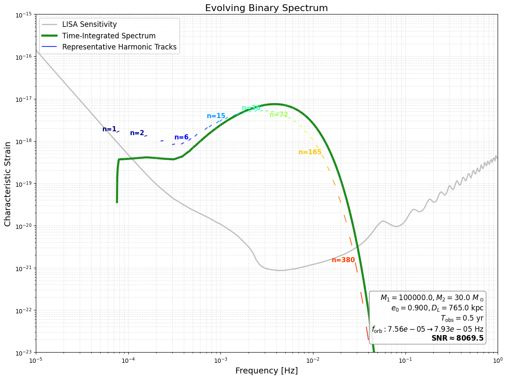
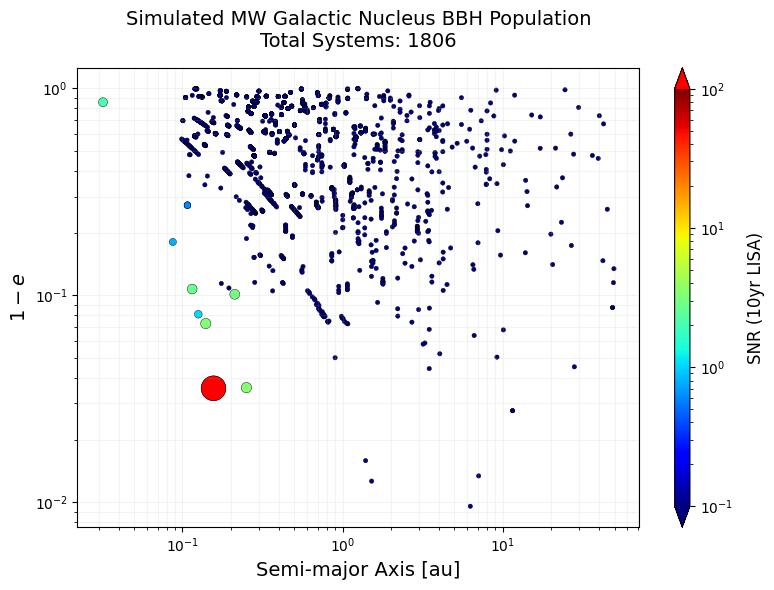
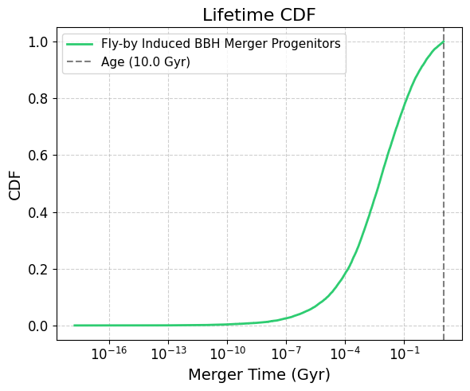
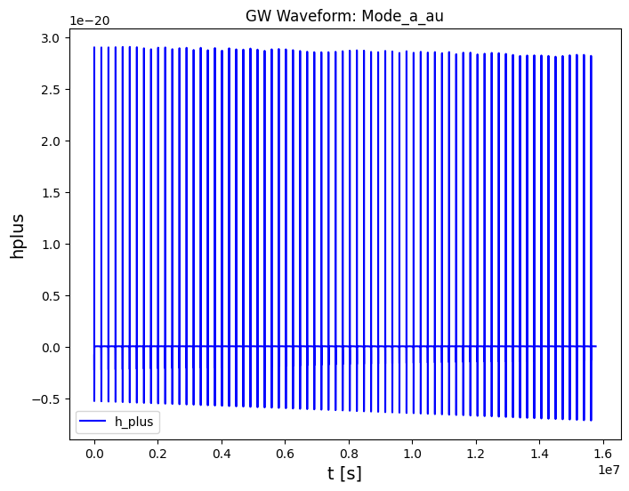
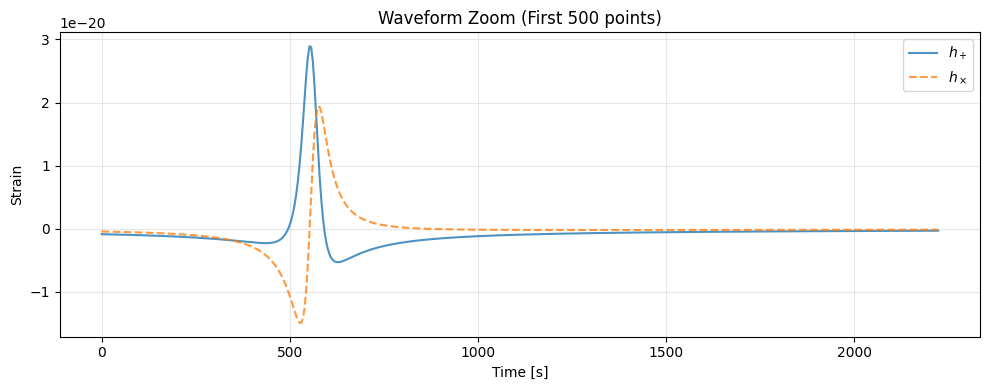
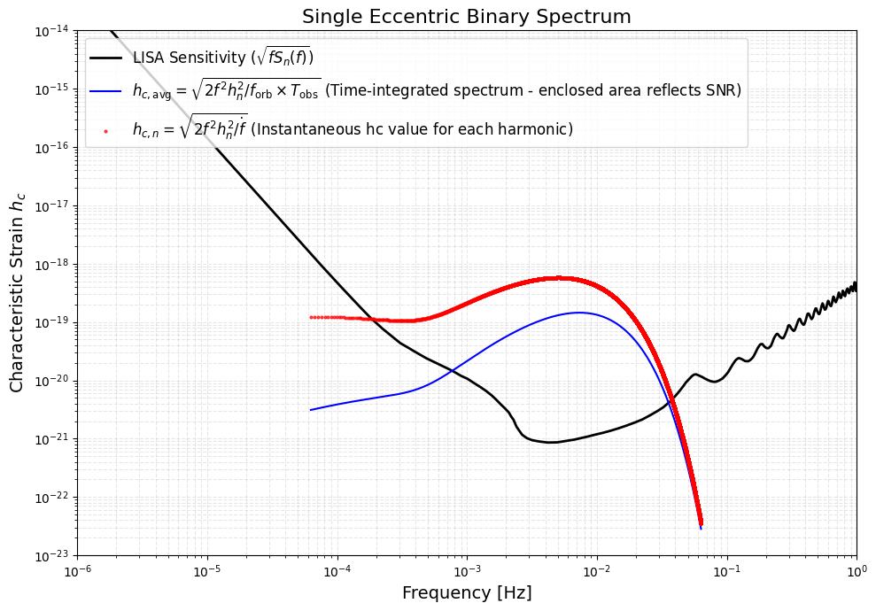

# LISAeccentric
**Xuan et al. (2026)**

## 📖 Overview

**LISAeccentric** is a Python toolkit for generating eccentric compact binary populations and computing their gravitational wave signals in the LISA band. It supports population synthesis, waveform computation, and signal analysis, including:

### 📂 BBH Population Catalogs

* 🌌 **Galactic Nuclei (GN)**: SMBH-perturbed mergers (steady-state & starburst)
    * *Based on:* Hoang et al. (2018) [ApJ 856 140]; Xuan et al. (2024a) [ApJ 965 148]; Stephan et al. (2019) [ApJ 878 58]

* ✨ **Globular Clusters (GC)**: Dynamically formed BBHs, including in-cluster and ejected mergers
    * *Based on:* Kremer et al. (2020) [ApJS 247 48]; Zevin et al. (2020) [ApJ 903 67]; Xuan et al. (2025b) [ApJL 985 L42]

* 🌠 **Galactic Field**: Fly-by–induced mergers in Milky Way–like and elliptical galaxies
    * *Based on:* Michaely & Perets (2019) [ApJL 887 L36]; Raveh et al. (2022) [MNRAS 514.4246R]; Michaely & Naoz (2022) [ApJ 936 184]; Xuan et al. (2024a) [ApJ 965 148]

### 🛠 Waveform & Signal Analysis

* Generate PN-based, time-domain waveforms for eccentric binaries (3PN, non-spinning). [PhysRevD.82.024033]
* Evolve orbital parameters throughout the inspiral stage. [PhysRev.136.B1224]
* Compute the LISA detector response for a single Michelson signal. [PhysRevD.67.022001]
* Evaluate characteristic strain ($h_c$) and stochastic backgrounds. [PhysRevD.110.023020]
* Calculate signal-to-noise ratio (SNR) and noise-weighted inner products for time-domain waveforms.

---

## 💾 Installation

You can install `LISAeccentric` directly from GitHub without manually downloading or unzipping files. Please choose the method that matches your environment.

#### Method 1: Jupyter Notebook / Google Colab (Recommended)
If you are working in a notebook (Jupyter, Colab, Kaggle), run the following command in a code cell. 
```
!pip install https://github.com/zeyuanxuan/LISAeccentric/archive/refs/heads/main.zip
```
#### Method 2: Terminal / Command Line
If you are using a standard terminal, run the command without the !
```
pip install https://github.com/zeyuanxuan/LISAeccentric/archive/refs/heads/main.zip
```
**Note:** for Mac/Linux: If pip command is not found or defaults to Python 2, try using pip3 instead: 
```
pip3 install https://github.com/zeyuanxuan/LISAeccentric/archive/refs/heads/main.zip
```
#### Method 3: University Clusters / HPC
If you are running jobs on a cluster using existing Python modules (like `module load python/3.9.6`), **load the same module before installing.**

Step 1: Load the Python module you intend to use in your job script
```
# Example: If your submission script uses python/3.9.6, load it now:
module load python/3.9.6
```
Step 2: Install the package with --user. This installs the package into your local directory specific to that Python version (e.g., ~/.local/lib/python3.9/site-packages).
```
python3 -m pip install --user https://github.com/zeyuanxuan/LISAeccentric/archive/refs/heads/main.zip
```
Step 3: Import LISAeccentric in your code and run your job
```
# In your job script (.sh/.pbs):
module load python/3.9.6
python your_script.py
```

## 🎯 Features & Usage Examples

### 1️⃣ Global Configuration

#### `LISAeccentric.set_output_control`
Sets the global verbosity and warning suppression levels.
* **Input**: 
    * `verbose` (bool): If `False`, disables internal library printing.
    * `show_warnings` (bool): If `False`, suppresses warnings.
* **Output**: `None`.

**Example:**
```python
# Set verbose=False to disable internal library printing.
LISAeccentric.set_output_control(verbose=False, show_warnings=False)
```

___

### 2️⃣ CompactBinary Class
The fundamental unit of the package. This class handles the physics, evolution, and I/O for a single binary system.

#### `LISAeccentric.CompactBinary()`
To create a binary system object:
* **Input**:
    * `m1`, `m2` (float): Masses. [m_sun]
    * `a` (float): Semi-major axis. [au]
    * `e` (float): Eccentricity.
    * `Dl` (float): Luminosity distance. [kpc]
    * `label` (str): Identifier.
    * `extra` (dict, optional): Dictionary for storing extended parameters (e.g., SNR, inclination **[rad]**, spin, lifetime).
* **Output**: `CompactBinary` object.

**Example:**
```python
my_binary = LISAeccentric.CompactBinary(
    m1=10.0, m2=10.0, a=0.26, e=0.985, Dl=8.0, 
    label="Tutorial_Core_Obj",
    extra={
        'inclination': 0.7854,  # [rad] (~45 degrees)
    }
)
print(f"   Output Object: {my_binary}")
print(f"   Type Inspection: {type(my_binary)}")
# You can also access extra data directly
print(f"   Inclination: {my_binary.extra['inclination']:.4f} rad")
```
* **Output**:
  ```
   Output Object: <CompactBinary [Tutorial_Core_Obj]: M=10.0+10.0 m_sun, a=2.600e-01AU, e=0.9850, Dl=8.0kpc | inclination=0.785>
   Type Inspection: <class 'LISAeccentric.core.CompactBinary'>
   Inclination: 0.7854 rad
  ```

___

#### `.compute_merger_time()`
Calculates the remaining time until the merger due to gravitational wave emission.
* **Input**: None (uses object attributes).
* **Output**:
    * `t_merge_yr` (float): Time to merger in years.

**Example:**
```python
t_merge_yr = my_binary.compute_merger_time(verbose=False)
print(f"      Return Value: {t_merge_yr:.4e} [years] (Type: float)")
```
* **Output**:
  ```
         Return Value: 4.8407e+06 [years] (Type: float)
  ```

___


#### `.compute_snr_analytical()`
Computes the sky-averaged Signal-to-Noise Ratio (SNR) for the LISA detector. This method supports two calculation modes: full integration over harmonics (default) or a fast approximation.
* **Input**:
    * `tobs_yr` (float): Observation duration in years.
    * `quick_analytical` (bool, optional):
        * If `False` (default): Uses full integration (summing over harmonics via `PN_waveform.SNR`).
        * If `True`: Uses a fast geometric approximation based on peak frequency and amplitude, suitable for high-e systems.
    * `verbose` (bool, optional): Controls standard output printing. Default is `True`.
* **Output**:
    * `snr_val` (float): The calculated SNR value.
* **Note:** The calculation assumes the binary's evolution is negilible during the observation.
  
**Example:**
```python
snr_val = my_binary.compute_snr_analytical(tobs_yr=4.0, verbose=False, quick_analytical=False)
print(f"      Return Value: {snr_val:.4f} (Type: float)")
```
* **Output**:
  ```
      Return Value: 10.9644 (Type: float)
  ```

___


#### `.compute_fpeak()`
Calculates the peak gravitational wave frequency ($f_{\rm peak}$) for the eccentric binary using the Wen (2003) approximation. For highly eccentric systems, the GW power peaks at a frequency significantly higher than the orbital frequency: $f_{\rm peak} \approx f_{\rm orb} \frac{(1+e)^{1.1954}}{(1-e)^{1.5}}$.

* **Input**:
    * `verbose` (bool, optional): Controls standard output printing. Default is `True`.
* **Output**:
    * `f_peak` (float): Peak GW frequency [Hz].
    * **Note**: The result is also stored in `self.extra['f_peak_Hz']`.

**Example:**
```python
f_peak = my_binary.compute_fpeak(verbose=False)
print(f"      Return Value: {f_peak:.4e} [Hz] (Type: float)")
```
* **Output**:
  ```
       Return Value: 1.3205e-03 [Hz] (Type: float)
  ```

___


#### `.evolve_orbit()`
Predicts the future state of the binary system by evolving its orbital parameters forward in time due to gravitational wave emission (Peters64 formula).
* **Input**:
    * `delta_t_yr` (float): Time duration to evolve the system in years.
    * `update_self` (bool, optional):
        * If `True`: Updates the `a` and `e` attributes of the `CompactBinary` object itself.
        * If `False` (default): Returns the new values without modifying the object.
    * `verbose` (bool, optional): Controls standard output printing.
* **Output**:
    * `a_new` (float): The evolved semi-major axis [au].
    * `e_new` (float): The evolved eccentricity.

**Example:**
```python
a_new, e_new = my_binary.evolve_orbit(delta_t_yr=1000.0, update_self=False, verbose=False)
print(f"      Return Tuple: a={a_new} au, e={e_new}")
```
* **Output**:
  ```
        Return Tuple: a=0.25991616861323 au, e=0.9849951873952284
  ```

___

  
#### `.compute_waveform()`
A convenience method to compute the Gravitational Wave (GW) waveform specifically for the initialized binary system. It automatically utilizes the object's internal physical attributes ($m_1, m_2, a, e, D_L$) and supports adaptive time sampling.
* **Input**:
    * Observation:
        * `tobs_yr` (float): Observation duration in years.
        * `initial_orbital_phase` (float, optional): Initial mean anomaly $l_0$ [rad]. Default is 0.
    * Source Geometry:
        * `theta` (float, optional): Line-of-sight inclination angle in source frame $\theta$ [rad]. Default is $\pi/4$.
        * `phi` (float, optional): Line-of-sight azimuthal angle in source frame $\phi$ [rad]. Default is $\pi/4$.
    * Physics Model:
        * `PN_orbit` (int, optional): PN order for conservative orbital dynamics (0, 1, 2, 3). Default is 3.
        * `PN_reaction` (int, optional): PN order for radiation reaction (0, 1, 2). Default is 2.
    * Computational Control:
        * `ts` (float, optional): Fixed sampling time step [s]. If `None` (default), uses adaptive sampling.
        * `points_per_peak` (int, optional): Resolution for adaptive sampling (points per periastron passage). Default is 50.
        * `max_memory_GB` (float, optional): Safety limit for array size in GB. Default is 16.0.
    * Output Control:
        * `plot` (bool, optional): If `True`, plots the $h_+$ waveform.
        * `verbose` (bool, optional): Controls standard output printing.
* **Output**:
    * A list of three NumPy arrays: `[time_vector, h_plus, h_cross]`.
    * Returns `None` if calculation fails.
* **Note:** If the merger time is shorter than tobs, the code will truncate the waveform before reaching the ISCO.
  
**Example:**
```python
wf_data_obj = my_binary.compute_waveform(
    tobs_yr=1.0, points_per_peak=50, verbose=False, plot=True
)
```
* **Output**:
<p align="left">
  
</p>

___


#### `.compute_characteristic_strain()`
Computes the characteristic strain spectrum ($h_c$) for the binary system by decomposing the signal into orbital harmonics.
* **Note:** This fast calculation method assumes the binary's evolution is negilible during the observation.
* **Input**:
    * `tobs_yr` (float): Integration time in years.
    * `plot` (bool, optional): If `True`, generates a spectrum plot.
* **Output**:
    * A list of 4 NumPy arrays: `[freq, hc_spectrum, harmonics, snr_contrib]`.
        * `[0] freq`: Frequency List [Hz].
        * `[1] hc_spectrum`: Time-integrated Spectrum Amplitude ($h_{c,\rm avg}$), representing the accumulated signal over $T_{\rm obs}$.
        * `[2] harmonics`: Instantaneous characteristic strain ($h_{c,n}$) for each harmonic.
        * `[3] snr_contrib`: Contribution to noise power spectral density ($S_n(f)$) at harmonic frequencies.
  
**Example:**
```python
strain_res_list = my_binary.compute_characteristic_strain(tobs_yr=4.0, plot=True)
```
* **Output**:
<p align="left">
  
</p>

___


#### `.compute_characteristic_strain_evolve()`
Computes the **time-evolving** characteristic strain spectrum ($h_c$) by integrating the signal along the binary's evolutionary track (using Peters 1964 equations). This method captures the "chirping" of harmonics across the frequency band.
* **Note:** Unlike the static method, this handles significant orbital evolution (chirping) during the observation window.
* **Input**:
    * `tobs_yr` (float): Integration time in years.
    * `target_n_points` (int, optional): Number of harmonics to track for visualization (default: 100). Ignored if `all_harmonics=True`.
    * `all_harmonics` (bool, optional):
        * `False` (Default): Uses optimized high-density sampling for spectrum integration and sparse sampling for plotting tracks. Fast and visually clear.
        * `True`: Forces calculation of *all* integer harmonics within the band for tracks. Slower but rigorous.
    * `plot` (bool, optional): If `True`, generates a plot showing both the instantaneous harmonic tracks and the total integrated spectrum.

* **Output**:
    * A list of 4 elements: `[freq, hc_spectrum, snapshots, snr]`.
        * `[0] freq`: Unified Frequency Axis [Hz] (log-spaced).
        * `[1] hc_spectrum`: Total Time-integrated Characteristic Strain ($h_{c,\rm avg}$) accumulated over $T_{\rm obs}$.
        * `[2] snapshots`: A list of dictionaries, where each dictionary represents the system's state at a specific time step (containing `t`, `f_orb`, `e`, `hnc`, etc.).
        * `[3] snr`: The integrated Signal-to-Noise Ratio (SNR) calculated from the spectrum.
**Example:**
```python
my_binary_evolve = LISAeccentric.CompactBinary(
    m1=1e5,      # Primary Mass [M_sun]
    m2=30.0,     # Secondary Mass [M_sun]
    a=0.26,      # Semi-major Axis [AU]
    e=0.9,       # Eccentricity
    Dl=765.0,    # Luminosity Distance [kpc]
    label="Evolving_Source_Example"
)
evolve_res = my_binary_evolve.compute_characteristic_strain_evolve(
    tobs_yr=0.5,
    target_n_points=50,
    all_harmonics=False,
    plot=True,
    verbose=True
)
if evolve_res is not None:
    f_axis, hc_total, snapshots, snr = evolve_res
    print(f"\n   Output Inspection (List of 4 Elements):")
    print(f"      [0] Unified Frequency Axis (shape: {f_axis.shape})")
    print(f"          - Range: {f_axis[0]:.1e} Hz to {f_axis[-1]:.1e} Hz")
    print(f"      [1] Total Integrated Strain (h_c) (shape: {hc_total.shape})")
    print(f"          - Peak Amplitude: {np.max(hc_total):.4e}")
    print(f"      [2] Snapshots List (Length: {len(snapshots)})")
    print(f"          - Contains time-step details (t, f_orb, e, n, hnc...)")
    print(f"          - Example Keys: {list(snapshots[0].keys()) if len(snapshots)>0 else 'Empty'}")
    print(f"      [3] Integrated SNR (float)")
    print(f"          - Value: {snr:.4f}")
```
* **Output**:
  ```
   Output Inspection (List of 4 Elements):
      [0] Unified Frequency Axis (shape: (2000,))
          - Range: 1.0e-06 Hz to 1.0e+00 Hz
      [1] Total Integrated Strain (h_c) (shape: (2000,))
          - Peak Amplitude: 7.4468e-18
      [2] Snapshots List (Length: 100)
          - Contains time-step details (t, f_orb, e, n, hnc...)
          - Example Keys: ['t', 'f_orb', 'n', 'freq', 'hnc']
      [3] Integrated SNR (float)
          - Value: 8069.5495
  ```
<p align="left">
  
</p>

___


#### `.to_list()` `.from_list()`
Methods to convert `CompactBinary` objects to and from list formats, facilitating data storage (e.g., to CSV/NumPy files) and retrieval.
* **.to_list()**: 
    * **Input**: `schema` (str) - formatting standard (default: snapshot_std, i.e., `['label', 'Dl', 'a', 'e', 'm1', 'm2', 'snr']`).
    * **Output**: A list representing the system's data.
* **.from_list()**: 
    * **Input**: `data_list` (list) - raw data values; `schema` (str).
    * **Output**: A new `CompactBinary` object instantiated from the list.

**Example:**
```python
    # Export
    print("   A. to_list(schema='snapshot_std')")
    data_row = my_binary.to_list(schema='snapshot_std')
    print(f"      Output: {data_row} (Type: List)")
    # Import
    print("   B. from_list(data_list=..., schema='snapshot_std')")
    raw_in = ["Imp_Sys", 16.8, 0.5, 0.9, 50.0, 50.0, 0.0]
    new_obj = LISAeccentric.CompactBinary.from_list(data_list=raw_in, schema='snapshot_std')
    print(f"      Output: {new_obj}")
  ```
* **Output**:
    ```
    A. to_list(schema='snapshot_std')
      Output: ['Tutorial_Core_Obj', 8.0, 0.26, 0.985, 10.0, 10.0, 0.0] (Type: List)
   B. from_list(data_list=..., schema='snapshot_std')
      Output: <CompactBinary [Imp_Sys]: M=50.0+50.0 m_sun, a=0.50AU, e=0.9000, Dl=16.8kpc, SNR=0.00>
    ```

___


### 3️⃣ Population analysis
#### 3.1 Galactic Nuclei (GN)
This module models Binary Black Holes formed dynamically in the Milky Way galactic nuclei (due to the perturbation of the central supermassive black hole). It is based on detailed three-body simulations.

___


#### ` LISAeccentric.GN.sample_eccentricities()`
Randomly samples $N$ merger eccentricities for BBHs formed in Galactic Nuclei, defined at the LIGO frequency band (10Hz).
* **Input**:
    * `n_samples` (int): Number of eccentricity samples to generate.
    * `max_bh_mass` (float, optional): Maximum Black Hole mass to consider for the population filter [$M_\odot$]. Default is 50.
    * `plot` (bool, optional): If `True`, plots the Cumulative Distribution Function (CDF) of $\log_{10}(e)$.
* **Output**:
    * `gn_e_samples` (NumPy Array): A 1D array containing the sampled eccentricity values at 10Hz.

**Example:**
```python
gn_e_samples = LISAeccentric.GN.sample_eccentricities(
    n_samples=5000, max_bh_mass=50.0, plot=True
)
print(f"   Output Shape: {np.shape(gn_e_samples)}")
print(f"   Mean Eccentricity: {np.mean(gn_e_samples)}")
```
* **Output**:
    ```
    Output Shape: (5000,)
    Mean Eccentricity: 3.791297808628803e-05
    ```
<p align="left">

</p>

___


#### `LISAeccentric.GN.get_progenitor()`
Retrieves the properties of the binary progenitors (initial states) from the underlying population catalog (BBH in GN, orbiting around a SMBH with M = 4e6 msun). These are the systems *before* they evolve to merger.
* **Input**:
    * `n_inspect` (int, optional): Number of random systems to retrieve for inspection. Default is 3.
* **Output**:
    * A list of `CompactBinary` objects representing the progenitor systems.
    * **Note**: The objects contain detailed GN evolutionary parameters in their `extra` attributes (e.g., outer orbit SMA `a2`, eccentricity `e2`, initial mutal orbit inclination `i`, and total `lifetime_yr`).

**Example:**
```python
gn_progenitors = LISAeccentric.GN.get_progenitor(n_inspect=3)
print(f"   Output List Length: {len(gn_progenitors)}")
print(f"   Sample Item: {gn_progenitors[0]}")
```
* **Output**:
    ```
   Output List Length: 3
   Sample Item: <CompactBinary [GN_Progenitor]: M=50.6+25.7 m_sun, a=3.395e-01AU, e=0.9278, Dl=8.0kpc | e2_init=0.505, i_init_rad=2.167, a2_init=1.57e+04, a_final=1.45e-05, e_final=3.04e-06, lifetime_yr=1.03e+08>
    ```

___


#### `LISAeccentric.GN.get_snapshot()`
Generates a snapshot of the BBH population currently in the GN. This includes systems from both the steady-state formation channel and a recent starburst event (Young Nuclear Cluster, YNC). The results can be changed by adjusting the BBH formation rate in the steady-state population and the age and total BBH number in the YNC population.
* **Input**:
    * `rate_gn` (float, optional): Merger rate for the steady-state channel [Myr$^{-1}$]. Default is 2.0.
    * `age_ync` (float, optional): Age of the Young Nuclear Cluster [yr]. Default is 6.0e6.
    * `n_ync_sys` (int, optional): Number of systems to simulate for the YNC channel. Default is 100.
    * `max_bh_mass` (float, optional): Maximum Black Hole mass to consider [$M_\odot$]. Default is 50.
    * `plot` (bool, optional): If `True`, plots the snapshot population ($1-e$ vs. $a$, color-coded by SNR).
* **Output**:
    * A list of `CompactBinary` objects representing the BBHs in the Milky Way center, typically sorted by SNR.

**Example:**
```python
gn_snapshot = LISAeccentric.GN.get_snapshot(
    rate_gn=2.0, age_ync=6.0e6, n_ync_sys=100, max_bh_mass=50.0, plot=True
)
print(f"   Output List Length: {len(gn_snapshot)} systems")
```
* **Output**:
    ```
   Output List Length: 1806 systems
    ```
<p align="left">

</p>

___


### 3.2 Globular Clusters (GC)
This module models Binary Black Holes formed dynamically in Milky Way globular clusters. It supports sampling from specific dynamic formation channels (e.g., Kozai-Lidov triples, binary-single captures) based on detailed Monte Carlo N-body simulations.

___


#### `LISAeccentric.GC.sample_eccentricities()`
Randomly samples $N$ merger eccentricities for GC BBHs at the LIGO frequency band (10Hz).
* **Input**:
    * `n` (int): Number of eccentricity samples to generate.
    * `channel_name` (str): Specific formation channel.
        * `'Incluster'`: Weighted average of all in-cluster channels (default).
        * `'Ejected'`: Mergers occurring after ejection.
        * **Sub-channels**: Supports specific dynamical channels such as `'KL Triple'`, `'Non-KL Triple'`, `'Single Capture'`, `'Fewbody Capture'`.
    * `plot` (bool, optional): If `True`, plots the CDF of $\log_{10}(e)$.
* **Output**:
    * `gc_e_samples` (NumPy Array): A 1D array containing the sampled eccentricity values at 10Hz.

**Example:**
```python
gc_e_samples = LISAeccentric.GC.sample_eccentricities(
    n=5000, channel_name='KL Triple', plot=True
)
print(f"   Output Shape: {np.shape(gc_e_samples)}")
```
* **Output**:
    ```
   Output Shape: (5000,)
    ```
<p align="left">

</p>

___


#### `LISAeccentric.GC.get_snapshot()`
Retrieves a snapshot of the GC BBH population in the Milky Way. This method supports three retrieval modes to allow for different scales of analysis (full ensemble vs. single galaxy realization).
* **Input**:
    * `mode` (str): Data selection mode.
        * `'10_realizations'`: Returns the full catalog from 10 MW realizations (~2300 systems).
        * `'single'`: Returns data from a single MW realization (randomly selected subset, ~230 systems).
        * `'random'`: Returns a specific number of randomly selected systems.
    * `n_random` (int, optional): Number of systems to retrieve (only used if `mode='random'`). Default is 500.
    * `plot` (bool, optional): If `True`, plots the snapshot ($1-e$ vs $a$).
* **Output**:
    * A list of `CompactBinary` objects.
    * **Warning**: The underlying catalog represents a finite set of simulations (~230 systems per realization). If `n_random` exceeds the size of a single realization, the returned sample will inevitably mix systems from different stochastic realizations. Due to the small sample size of the MC N-body source catalog, these samples may not be strictly statistically independent.

**Example:**
```python
gc_data_full = LISAeccentric.GC.get_snapshot(mode='10_realizations', plot=True)
print(f"   Output List Length: {len(gc_data_full)}")
```
* **Output**:
    ```
   Output List Length: 2325
    ```
<p align="left">

</p>

___


### 3.2 Galactic Field (Field)
This module models Binary Black Holes mergers formed via dynamic fly-by interactions in galactic field environments. It supports simulations for both Milky Way-like (disk) galaxies and Elliptical galaxies.

___


#### `LISAeccentric.Field.run_simulation()`
Executes a Monte Carlo simulation to generate a population of fly-by mergers based on specific galactic structure and physical parameters. The results are saved to disk for subsequent analysis (sampling/snapshotting).

* **Input**:
    * `galaxy_type` (str, optional): Target environment `'MW'` (Milky Way) or `'Elliptical'`. Default: `'MW'`.
    * **Physics Parameters**:
        * `m1`, `m2`, `mp` (float, optional): Masses of the binary components and perturber [$M_\odot$]. Default: `10`, `10`, `0.6`.
        * `fbh` (float, optional): Fraction of stars that are wide binary black holes. Default: `7.5e-4`.
        * `fgw` (float, optional): Gravitational wave frequency for getting the eccentricity distribution (default 10Hz, LIGO band). Default: `10`.
        * `formation_mod` (str, optional): Star formation history model (e.g., `'starburst'`, `'continuous'`). Default: `'starburst'`.
    * **Structure Parameters (MW)**:
        * `n0` (float, optional): Stellar number density normalization in the solar neighborhood [pc$^{-3}$]. Default: `0.1`.
        * `rsun` (float, optional): Distance of the solar system to the Galactic center [pc]. Default: `8000.0` (8e3).
        * `Rl`, `h` (float, optional): Galactic scale lengths (Radial length, Vertical height) [pc]. Default: `2600.0`, `1000.0`.
        * `sigmav` (float, optional): Velocity dispersion [m/s]. Default: `50000.0` (50e3).
        * `age_mw` (float, optional): Age of the MW galaxy [years]. Default: `10e9`.
    * **Structure Parameters (Elliptical)**:
        * `M_gal` (float, optional): Total mass of the galaxy [$M_\odot$]. Default: `1.0e12`.
        * `Re` (float, optional): Effective radius (half-light radius) [pc]. Default: `8000.0`.
        * `distance_Mpc` (float, optional): Distance to the galaxy [Mpc]. Default: `16.8`.
        * `age_ell` (float, optional): Age of the elliptical galaxy [years]. Default: `13e9`.
    * **Control**:
        * `arange_log` (list, optional): Range of BBH semi-major axis $\log_{10}(a)$ to sample [min, max] in au. Default: `[2, 4.5]`.
        * **For MW**:
            * `n_sim_samples` (int, optional): Total number of MC trials. Default: `200000`.
            * `target_N` (int, optional): Target number of successful mergers to accumulate. Default: `100000`.
            * `rrange_mw` (list, optional): Radial range for simulation [min, max] in kpc. Default: `[0.5, 15]`.
        * **For Elliptical**:
            * `ell_n_sim` (int, optional): Total number of MC trials. Default: `100000`.
            * `ell_target_N` (int, optional): Target number of successful mergers to accumulate. Default: `50000`.
            * `rrange_ell` (list, optional): Radial range for simulation [min, max] in kpc. Default: `[0.05, 100]`.
* **Output**:
    * `None`. (Results are saved internally to `data/` directory).

**Example:**
```python
LISAeccentric.Field.run_simulation(
    galaxy_type='MW',
    # Physics (Optional overrides)
    m1=10.0, m2=10.0, mp=0.6, 
    fbh=7.5e-4, fgw=10.0,
    formation_mod='starburst',
    # Structure (Optional overrides)
    n0=0.1, rsun=8000.0, Rl=2600.0, h=1000.0, sigmav=50000.0,
    # Control (Optional overrides)
    n_sim_samples=200000, target_N=100000, rrange_mw=[0.5, 15]
)
print("   Status: Simulation completed and saved.")
```
#### Extension: Simulating an Elliptical Galaxy
The simulation engine can also model massive elliptical galaxies (e.g., M87-like) by switching the `galaxy_type` to `'Elliptical'` and adjusting the structural parameters ($M_{\rm gal}$, $R_e$).

**Example:**
```python
LISAeccentric.Field.run_simulation(
    galaxy_type='Elliptical',
    # Structure (Massive Galaxy at 16.8 Mpc)
    distance_Mpc=16.8, M_gal=1.0e12, Re=8000.0,
    # Physics (Heavier BHs)
    m1=30.0, m2=30.0, mp=0.6,
    # Control (Smaller run for demo)
    ell_n_sim=50000, ell_target_N=20000
)
print("   Status: Elliptical simulation saved.")
```

___


#### `LISAeccentric.Field.get_progenitor()`
Retrieves the properties of the binary progenitors (initial states at formation) from the simulated library. These represent the system parameters right after being perturbed to high eccentricity and start evolving via GW emission. 

* **Input**:
    * `galaxy_type` (str, optional): Target environment `'MW'` (Milky Way) or `'Elliptical'`. Default: `'MW'`.
    * `plot` (bool, optional): If `True`, plots the initial semi-major axis distribution and the merger lifetime CDF. Default: `True`.
* **Output**:
    * A list of `CompactBinary` objects representing the progenitor systems. The length of the list equals `target_N` when running the galaxy simulation.
    * **Note**: These objects contain detailed simulation statistics in their `extra` attributes, including:
        * `merger_rate`: Effective merger rate weight for this system.
        * `lifetime_yr`: Total time from formation to merger.
        * `e_final_LIGO`: Eccentricity when entering the LIGO band.

**Example:**
```python
field_progs = LISAeccentric.Field.get_progenitor(galaxy_type='MW', plot=True)
print(f"   Output List Length: {len(field_progs)}")
```
* **Output**:
    ```
   Output List Length: 50000
    ```
<p align="left">

</p>
<p align="left">

</p>

___


#### `LISAeccentric.Field.sample_eccentricities()`
Randomly samples $N$ merger eccentricities for Field BBHs at the LIGO frequency band (10Hz).
* **Input**:
    * `n` (int): Number of eccentricity samples to generate.
    * `galaxy_type` (str, optional): Target environment `'MW'` (Milky Way) or `'Elliptical'`. Default: `'MW'`.
    * `plot` (bool, optional): If `True`, plots the CDF of $\log_{10}(e)$.
* **Output**:
    * `gc_e_samples` (NumPy Array): A 1D array containing the sampled eccentricity values at 10Hz.

**Example:**
```python
field_e_samples = LISAeccentric.Field.sample_eccentricities(
    n=5000, galaxy_type='MW', plot=True
)
print(f"   Output Shape: {np.shape(field_e_samples)}")
```
* **Output**:
    ```
   Output Shape: (5000,)
    ```
<p align="left">

</p>

___


#### `LISAeccentric.Field.get_snapshot()`
Generates a "snapshot" containing BBH systems that currently exist in the Galactic Field. These systems represent binaries that have been excited to high eccentricity via fly-by interactions and are predicted to merge within the specified future time window (`t_window_Gyr`).
* **Input**:
    * `mode` (str, optional): Sampling mode. Default: `'single'`.
        * `'single'`: Generates one random realization of the galaxy based on the calculated merger rate.
        * `'multi'`: (MW only) Stacks multiple realizations to reduce statistical variance.
        * `'forced'`: Randomly selects `n_systems` regardless of physical rates (useful for testing).
    * `galaxy_type` (str, optional): Target environment `'MW'` or `'Elliptical'`. Default: `'MW'`.
    * `t_obs` (float, optional): Observation duration in years (defines the SNR accumulation window). Default: `10.0`.
    * `t_window_Gyr` (float, optional): The future time window to look for merging systems.
        * **Note**: This should ideally **NOT** exceed the galaxy age (e.g., 10 Gyr). Extending the window beyond the age implies looking for systems that would have likely been removed or merged earlier in the simulation history.
    * `n_realizations` (int, optional): Number of realizations (only for `mode='multi'`). Default: `10`.
    * `n_systems` (int, optional): Number of systems to force-sample (only for `mode='forced'`). Default: `500`.
    * `plot` (bool, optional): If `True`, plots the snapshot distribution. Default: `True`.
* **Output**:
    * A list of `CompactBinary` objects representing the detectable sources.

**Example:**
```python
field_snapshot_mw = LISAeccentric.Field.get_snapshot(
    mode='single', t_obs=10.0, t_window_Gyr=10.0, galaxy_type='MW', plot=True
)
print(f"   Output List Length: {len(field_snapshot_mw)}")
```
* **Output**:
    ```
   Output List Length: 72
    ```
<p align="left">

</p>

___


### 4️⃣ Waveform & Analysis Pipeline
This module provides a low-level functional interface to generate and analyze Eccentric Gravitational Waveforms. 

___


#### `LISAeccentric.Waveform.compute_waveform()`
Generates the time-domain waveform ($h_+, h_\times$) using PN evolution model.

* **Input**:
     * **Input Mode Selector**:
        * `input_mode` (str, optional): Determines the interpretation of the `a_au` parameter. Default: `'a_au'`.
            * `'a_au'`: Input `a_au` is treated as **Semi-major Axis [AU]**.
            * `'forb_Hz'`: Input `a_au` is treated as **Orbital Frequency [Hz]**.
            * `'fangular_Hz'`: Input `a_au` is treated as **Angular/Peak Frequency [Hz]** (Solver finds corresponding $f_{orb}$).
        * `a_au` (float): The value corresponding to the selected `input_mode`.
    * **Physical Parameters**:
        * `m1_msun`, `m2_msun` (float): Component masses [$M_\odot$].
        * `e` (float): Orbital eccentricity.
        * `Dl_kpc` (float): Luminosity distance [kpc].
        * `tobs_yr` (float): Observation duration [years].
        * `theta`, `phi` (float, optional): Sky position angles [rad]. Default: $\pi/4$.
        * `initial_orbital_phase` (float, optional): Initial mean anomaly/phase. Default: 0.
    * **Model & Sampling**:
        * `PN_orbit`, `PN_reaction` (int, optional): Post-Newtonian orders. Default: 3, 2.
        * `points_per_peak` (int, optional): Adaptive sampling density per periastron. Default: 50.
        * `ts` (float, optional): Fixed time step [seconds]. If set, overrides adaptive sampling.
    * `plot` (bool, optional): If `True`, plots the waveform.
* **Output**:
    * A list containing three NumPy arrays: `[time_vector, h_plus, h_cross]`.

**Example:**
```python

# Shift specific initial phase to show periastron GW burst
e_val = 0.99
init_phase = -5*np.pi * np.power(1 - e_val, 1.5)

waveform_data = LISAeccentric.Waveform.compute_waveform(
    # --- System Params ---
    m1_msun=10.0, m2_msun=10.0,
    a_au=0.1, e=e_val,          # <--- When input_mode= 'a_au' (default), input represents SMA: a = 1 au
    Dl_kpc=8.0, 
    input_mode='a_au',
    tobs_yr=0.5,
    initial_orbital_phase=init_phase,
    theta=np.pi/4, phi=np.pi/4,
    PN_orbit=3, PN_reaction=2,
    points_per_peak=50,         # Adaptive sampling resolution
    plot=True, verbose=True
)

waveform_data_B = LISAeccentric.Waveform.compute_waveform(
    m1_msun=10.0, m2_msun=10.0,
    a_au=1e-5, e=0.7,  # <--- 2nd Example: When input_mode='forb_Hz', input 'a_au' actually represents orbital frequency (f_orb =1e-5 Hz) 
    Dl_kpc=8.0, tobs_yr=0.1,
    input_mode='forb_Hz', ts = 10, # <--- 2nd Example: ts will turn off adaptive sampling and fix the sample interval of the waveform as 10 sec.
    plot=False
)
```
* **Output**:
<p align="left">

</p>

#### Data Inspection & Visualization
After generation, it is crucial to verify the data structure, calculate the sampling interval ($\Delta t$), and visualize the waveform details (e.g., the bursty structure at periastron).

* **Key Step**: Calculate `dt` from the first two time points (`t[1] - t[0]`).
* **Visualization**: Plotting a subset (e.g., first 500 points) allows for a quick check of the polarization phases.

**Example:**
```python
    t_vec, h_plus, h_cross = waveform_data[0], waveform_data[1], waveform_data[2]

    print(f"   Output Structure: List of 3 Numpy Arrays")
    print(f"      t_vec shape : {t_vec.shape}")
    print(f"      h_plus shape: {h_plus.shape}")
    print(f"      h_cross shape: {h_cross.shape}")

    # CRITICAL: Calculate Sampling Interval (dt) for next steps
    # We assume uniform sampling here (or check adaptive).
    dt_val_sec = t_vec[1] - t_vec[0]
    print(f"   Sample time dt    : {dt_val_sec:.4e} seconds (Passed to next step)")

    # Plot first 1000 points to see the burst structure
    plt.figure(figsize=(10, 4))
    N_plot = 500
    plt.plot(t_vec[:N_plot], h_plus[:N_plot], label=r'$h_+$', alpha=0.8)
    plt.plot(t_vec[:N_plot], h_cross[:N_plot], label=r'$h_\times$', alpha=0.8, ls='--')
    plt.xlabel('Time [s]')
    plt.ylabel('Strain')
    plt.title(f'Waveform Zoom (First {N_plot} points)')
    plt.legend()
    plt.grid(True, alpha=0.3)
    plt.tight_layout()
    plt.show()
```
* **Output**:
    ```
    Output Structure: List of 3 Numpy Arrays
    t_vec shape : (3535099,)
    h_plus shape: (3535099,)
    h_cross shape: (3535099,)
    Sample time dt    : 4.4604e+00 seconds (Passed to next step)
    ```
<p align="left">

</p>
Computes the Time-Delay Interferometry (TDI) response (specifically the $X$ channel or equivalent michelson response) for the LISA constellation. This function projects the $h_+$ and $h_\times$ polarizations onto the detector arms, accounting for the antenna pattern and time delays.

___


#### `LISAeccentric.Waveform.compute_LISA_response()`
* **Input**:
    * `dt_sample_sec` (float): Sampling interval of the input waveform [s].
    * `hplus`, `hcross` (NumPy Arrays): The input waveform polarizations.
    * **Source Location (Ecliptic Coordinates)**:
        * `theta_sky` (float): Sky Polar angle (co-latitude) of the source relative to the solar system [rad].
        * `phi_sky` (float): Azimuthal angle (relative to the solar system) [rad].
    * `psi_sky` (float): Polarization rotation [rad].
    * `timeshift_sec` (float, optional): Initial time shift applied to the signal [s]. Default: 0.0.
    * `plot` (bool, optional): If `True`, plots the detector response.
* **Output**:
    * A list containing two NumPy arrays: `[time_vector, response_signal]`.

**Example:**
```python
lisa_resp = LISAeccentric.Waveform.compute_LISA_response(
    dt_sample_sec=dt_val_sec,
    hplus=h_plus,
    hcross=h_cross,
    theta_sky=1.0, phi_sky=2.0, psi_sky=0.5,
    timeshift_sec=100.0,
    plot=True
)

if lisa_resp is not None:
    t_resp, y_resp = lisa_resp[0], lisa_resp[1]
    print(f"   Output Structure: List of 2 Arrays (Time, Response)")
    print(f"   Max Response Amplitude: {np.max(np.abs(y_resp)):.4e}")
```
* **Output**:
    ```
   Output Structure: List of 2 Arrays (Time, Response)
   Max Response Amplitude: 1.2626e-20
    ```
<p align="left">

</p>

___


#### `LISAeccentric.Waveform.compute_snr_analytical()`
Sky-averaged SNR, assuming the source evolves slowly.
* **Input**:
    * `m1_msun`, `m2_msun` (float): Component masses [$M_\odot$].
    * `a_au` (float): Semi-major axis [AU].
    * `e` (float): Eccentricity.
    * `Dl_kpc` (float): Luminosity distance [kpc].
    * `tobs_yr` (float): Observation time [years].
* **Output**:
    * `snr` (float): Estimated SNR value.
```python
snr_ana = LISAeccentric.Waveform.compute_snr_analytical(
    m1_msun=10.0, m2_msun=10.0,
    a_au=0.1, e=0.99,
    Dl_kpc=8.0, tobs_yr=0.5,
)
print(f"   [Analytical] SNR ~ {snr_ana:.4f}")
```
* **Output**:
    ```
     [Analytical] SNR ~ 354.9420
    ```
    
___


#### `LISAeccentric.Waveform.compute_snr_numerical()`
Computes SNR directly from the time-domain waveform array. Valid for arbitrary signals.
* **Input**:
    * `dt_sample_sec` (float): Sampling interval [s].
    * `strainlist` (NumPy Array): The waveform array (e.g., `h_plus` or detector response).
* **Output**:
    * `snr` (float): Calculated SNR value.

**Example:**
```python
    snr_num = LISAeccentric.Waveform.compute_snr_numerical(
        dt_sample_sec=dt_val_sec,
        strainlist=h_plus
    )
    print(f"   [Numerical]  SNR ~ {snr_num:.4f}")
```
* **Output**:
    ```
   [Numerical]  SNR ~ 283.0686
    ```

___


#### `LISAeccentric.Waveform.compute_inner_product()`
Computes the noise-weighted inner product $\langle h_1 | h_2 \rangle$ between two time-domain waveforms using the LISA sensitivity curve $S_n(f)$. This is the fundamental operation for matched filtering, overlap calculations, and determining signal orthogonality.

$$\langle h_1 | h_2 \rangle = 4 \Re \int_{f_{\min}}^{f_{\max}} \frac{\tilde{h}_1^*(f) \tilde{h}_2(f)}{S_n(f)} df$$

* **Input**:
    * `dt_sample_sec` (float): Sampling interval [s].
    * `h1`, `h2` (NumPy Arrays): Time-domain signal arrays (must have the same length).
* **Output**:
    * `inner_prod` (float): The calculated inner product value.

**Example:**
```python
inner_prod = LISAeccentric.Waveform.compute_inner_product(
    dt_sample_sec=dt_val_sec, 
    h1=h_plus, 
    h2=h_plus
)
print(f"   Inner Product Value: {inner_prod:.4e}")
print(f"   Sqrt(Inner Product): {np.sqrt(inner_prod):.4f} (Should match Numerical SNR)")
```
* **Output**:
    ```
   Inner Product Value: 8.0128e+04
   Sqrt(Inner Product): 283.0686 (Should match Numerical SNR)
    ```

___


#### `LISAeccentric.Waveform.compute_merger_time()`
* **Input**:
    * `m1_msun`, `m2_msun` (float): Component masses [$M_\odot$].
    * `a0_au` (float): Initial semi-major axis [au].
    * `e0` (float): Initial eccentricity.
* **Output**:
    * `t_merge` (float): Time to merger in years. Returns `inf` if the system is stable or parameters are invalid.

**Example:**
```python
t_merge = LISAeccentric.Waveform.compute_merger_time(
    m1_msun=10.0, m2_msun=10.0,
    a0_au=0.1, e0=0.99
)
print(f"   Merger Time: {t_merge:.4e} yr")
```
* **Output**:
    ```
   Merger Time: 2.6811e+04 yr
    ```
    
___


#### `LISAeccentric.Waveform.evolve_orbit()`
* **Input**:
    * `m1_msun`, `m2_msun` (float): Component masses [$M_\odot$].
    * `a0_au` (float): Initial semi-major axis [au].
    * `e0` (float): Initial eccentricity.
    * `delta_t_yr` (float): The time duration to evolve forward [years].
* **Output**:
    * `a_final` (float): Evolved semi-major axis [au].
    * `e_final` (float): Evolved eccentricity.

**Example:**
```python
    dt_evol = t_merge / 2.0
    print(f"   Evolving forward by {dt_evol:.2e} yr...")

    a_ev, e_ev = LISAeccentric.Waveform.evolve_orbit(
        m1_msun=10.0, m2_msun=10.0,
        a0_au=0.1, e0=0.99,
        delta_t_yr=dt_evol
    )
    print(f"   Result: a={a_ev:.4e} AU, e={e_ev:.6f}")
```
* **Output**:
    ```
   Evolving forward by 1.34e+04 yr...
   Result: a=3.4600e-02 AU, e=0.971288
    ```

___


#### `LISAeccentric.Waveform.compute_characteristic_strain_single()`
Computes the characteristic strain $h_c(f)$ of a single eccentric binary system. This function decomposes the signal into orbital harmonics, representing the signal strength relative to the LISA sensitivity curve in the frequency domain.
* **Input**:
    * `m1_msun`, `m2_msun` (float): Component masses [$M_\odot$].
    * `a_au` (float): Semi-major axis [AU].
    * `e` (float): Eccentricity.
    * `Dl_kpc` (float): Luminosity distance [kpc].
    * `tobs_yr` (float): Integration time [years].
    * `plot` (bool, optional): If `True`, plots the characteristic strain spectrum against the LISA sensitivity curve.
* **Output**:
    * A `list` containing 4 NumPy arrays:
        1.  `f_list`: Frequency bins [Hz] corresponding to the harmonics.
        2.  `hc_integrated`: Time-integrated characteristic strain spectrum (amplitude).
        3.  `hc_instant`: Instantaneous $h_c$ value for each harmonic peak.
        4.  `sn_contribution`: The signal's contribution to the Noise Power Spectral Density ($S_n(f)$).

**Example:**
```python
# --- 4.8 Characteristic Strain (Functional) ---
hc_res = LISAeccentric.Waveform.compute_characteristic_strain_single(
    m1_msun=10.0, m2_msun=10.0,
    a_au=0.1, e=0.99, Dl_kpc=8.0,
    tobs_yr=0.5, plot=True
)

strain_res_list = hc_res
if isinstance(strain_res_list, list) and len(strain_res_list) == 4:
    print(f"   Output: List of 4 Elements")
    print(f"      [0] Frequency List       (shape: {strain_res_list[0].shape})")
    print(f"      [1] Time-integrated Spectrum Amplitude (h_c) (shape: {strain_res_list[1].shape})")
    print(f"      [2] Instantaneous hc value for each harmonics (shape: {strain_res_list[2].shape})")
    print(f"      [3] Contribution to Snf  (shape: {strain_res_list[3].shape})")
else:
    print(f"   Output: {type(strain_res_list)}")
```
* **Output**:
    ```
   Output: List of 4 Elements
      [0] Frequency List       (shape: (14093,))
      [1] Time-integrated Spectrum Amplitude (h_c) (shape: (14093,))
      [2] Instantaneous hc value for each harmonics (shape: (14093,))
      [3] Contribution to Snf  (shape: (14093,))
    ```
<p align="left">

</p>


___


#### `LISAeccentric.Waveform.run_population_strain_analysis()`
Performs a batch characteristic strain analysis on a population of binaries. This function iterates through a list of `CompactBinary` objects, computes their individual spectra, and aggregates the results to estimate the total signal background or confusion noise.
* **Input**:
    * `binary_list` (list): A list of `CompactBinary` objects (e.g., from `GC.get_snapshot()` or `Field.get_snapshot()`).
    * `tobs_yr` (float): Integration time [years].
    * `plot` (bool, optional): If `True`, plots the combined population spectrum against the LISA sensitivity curve.
* **Output**:
    * A `list` containing aggregated results:
        1.  `faxis`: Common frequency axis array.
        2.  `Snf_tot`: Total Noise Power Spectral Density from the population.
        3.  `all_fn_lists`: List of frequency arrays for each binary.
        4.  `all_hcavg_lists`: List of time-integrated $h_c$ arrays for each binary.
        5.  `all_hnc_lists`: List of instantaneous $h_c$ arrays for each binary.

**Example:**
```python
if 'gn_snapshot' in locals() and len(gn_snapshot) > 0:
    batch_res = LISAeccentric.Waveform.run_population_strain_analysis(
        binary_list=gn_snapshot, 
        tobs_yr=4.0, 
        plot=True
    )
    
    # Unpack for inspection
    if batch_res is not None:
        faxis, Snf_tot = batch_res[0], batch_res[1]
        print(f"   Output Structure: [faxis, Snf_tot, ...]")
        print(f"      faxis shape  : {faxis.shape}")
        print(f"      Snf_tot shape: {Snf_tot.shape}")
else:
    print("   [Skip] No population snapshot available for batch analysis.")
```
* **Output**:
    ```
   Output Structure: [faxis, Snf_tot, ...]
      faxis shape  : (1000,)
      Snf_tot shape: (1000,)
    ```
<p align="left">

</p>

___


### 5️⃣ Noise Management
This module allows users to customize the LISA sensitivity curve used across the package. It supports generating specific noise models (e.g., N2A5 with galactic foregrounds) and converting them into characteristic strain for visualization.

___


#### `LISAeccentric.Noise.generate_noise_data()`
Generates synthetic noise Amplitude Spectral Density (ASD) data based on a specified model.
* **Input**:
    * `model` (str): The noise model to generate.
        * `'N2A5'`: Includes a specific realization of the galactic confusion noise foreground.
        * `'official'` : Loads the standard LISA Science Requirements Document sensitivity.
    * `f_min`, `f_max` (float, optional): Frequency bounds [Hz]. Default: `1e-5`, `1.0`.
* **Output**:
    * `f_new` (NumPy Array): Frequency array [Hz].
    * `asd_new` (NumPy Array): Amplitude Spectral Density [$\sqrt{Hz}^{-1}$].

**Example:**
```python
f_new, asd_new = LISAeccentric.Noise.generate_noise_data(
    model='N2A5', f_min=1e-5, f_max=1.0
)
print(f"   Generated Data: {len(f_new)} points.")
print(f"   Freq Range: [{f_new[0]:.1e}, {f_new[-1]:.1e}] Hz")
noise_char_strain = asd_new * np.sqrt(f_new)
# Plotting Characteristic Strain
plt.figure(figsize=(8, 5))
plt.loglog(f_new, noise_char_strain, label='N2A5 Model (Characteristic)', 
           color='darkred', linewidth=2)
plt.title("LISA Sensitivity Curve (Characteristic Strain)")
plt.xlabel("Frequency [Hz]", fontsize=12)
plt.ylabel(r"Characteristic Strain $\sqrt{f S_n(f)}$", fontsize=12)
plt.grid(True, which='both', linestyle='--', alpha=0.5)
plt.legend()
plt.show()
```
* **Output**:
    ```
   Generated Data: 3000 points.
   Freq Range: [1.0e-05, 1.0e+00] Hz
    ```
<p align="left">

</p>

___


#### `LISAeccentric.Noise.update_noise_curve()`
Updates the global noise data used by the `Waveform` module for SNR and Inner Product calculations. (Original one will be saved automatically with index 1,2,3...)
* **Input**:
    * `data` (list): `[frequency_array, asd_array]`.
      
**Example:**
```python
# Execution: Inject the new noise curve into the global system
LISAeccentric.Noise.update_noise_curve([f_new, asd_new])
```

___


#### `LISAeccentric.Noise.recover_noise_curve()`
Reverts the global noise configuration to a previous state or a standard preset.
* **Input**:
    * `version` (int or str):
        * If `int` (e.g., `1`): Reverts to a specific backup file ID (e.g., `LISA_Noise_1.npy`).
        * If `'official'`: Reverts to the default/official LISA sensitivity curve.
        * If `'N2A5'`: Reverts to N2A5 backup.
          
**Example:**
```python
LISAeccentric.Noise.recover_noise_curve(version=1)
```

___


#### `LISAeccentric.Noise.get_noise_curve()`
Retrieves the currently active noise data for inspection.
* **Input**:
    * `plot` (bool, optional): If `True`, plots the current Characteristic Strain.
* **Output**:
    * A list `[frequency_array, characteristic_strain_array]`.
      
**Example:**
```python
curve_data = LISAeccentric.Noise.get_noise_curve(plot=True)
```
* **Output**:
<p align="left">

</p>

___


#### `LISAeccentric.Noise.clean_backups()`
Removes all temporary noise backup files created during the session.

___


**Example:**
```python
LISAeccentric.Noise.clean_backups()
```
